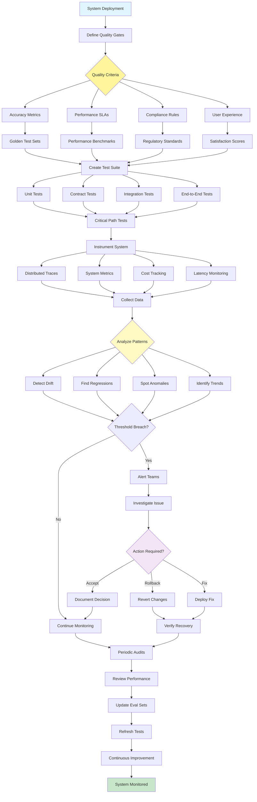

# Evaluation and Monitoring Pattern

Visual Diagram

## When to Use

- **Production systems**: Any system requiring reliability
- **Quality assurance**: Ensuring consistent performance
- **Compliance requirements**: Meeting regulatory standards
- **Performance optimization**: Identifying bottlenecks
- **Cost management**: Tracking resource usage
- **Continuous improvement**: Data-driven optimization

## Where It Fits

- **Enterprise AI deployments**: Mission-critical systems
- **SaaS platforms**: Multi-tenant service monitoring
- **Healthcare systems**: Patient safety monitoring
- **Financial services**: Trading system oversight
- **E-commerce**: Transaction and recommendation monitoring

## Pros

- **Reliability**: Early detection of issues
- **Performance visibility**: Clear system insights
- **Quality assurance**: Consistent output standards
- **Cost control**: Resource usage tracking
- **Compliance**: Audit trail maintenance
- **Improvement data**: Metrics guide optimization
- **User trust**: Transparent performance metrics

## Cons

- **Infrastructure overhead**: Monitoring systems require resources
- **Complexity**: Managing multiple metrics and alerts
- **Alert fatigue**: Too many notifications
- **Storage costs**: Logging and metrics data
- **Performance impact**: Instrumentation adds overhead
- **Maintenance burden**: Keeping tests updated
- **False positives**: Unnecessary alerts and rollbacks

## Real-World Examples

1. **E-commerce Recommendation Engine**:
   - Click-through rate monitoring
   - Conversion tracking
   - A/B test evaluation
   - Latency monitoring
   - Cost per recommendation
   - Drift detection in user preferences

2. **Customer Service Chatbot**:
   - Resolution rate tracking
   - Customer satisfaction scores
   - Response time monitoring
   - Escalation rate analysis
   - Cost per interaction
   - Quality sampling and review

3. **Financial Trading System**:
   - Trade execution monitoring
   - Slippage tracking
   - Risk limit compliance
   - Latency measurements
   - Profit/loss attribution
   - Regulatory audit logs

4. **Content Moderation Platform**:
   - Accuracy metrics (precision/recall)
   - False positive rates
   - Processing time per item
   - Human agreement scores
   - Cost per moderation
   - Policy violation trends

5. **Medical Diagnosis AI**:
   - Diagnostic accuracy rates
   - False negative monitoring
   - Time to diagnosis
   - Clinician agreement scores
   - System availability metrics
   - Patient outcome tracking

6. **Code Generation Tool**:
   - Code quality metrics
   - Compilation success rates
   - Test pass rates
   - Developer acceptance rates
   - Generation time tracking
   - Usage pattern analysis