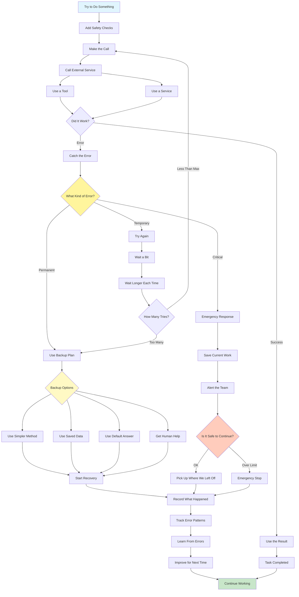

# Exception Handling and Recovery Pattern

Visual Diagram

## When to Use

- **Production environments**: Any system requiring high reliability
- **External dependencies**: When relying on APIs or services
- **Critical operations**: Tasks that must not fail completely
- **Unpredictable inputs**: Handling edge cases and anomalies
- **Network operations**: Managing connectivity issues
- **Resource constraints**: Dealing with limits and quotas

## Where It Fits

- **API integrations**: Handling service outages and rate limits
- **Data pipelines**: Managing corrupt data and processing failures
- **User-facing systems**: Maintaining service availability
- **Financial transactions**: Ensuring transaction integrity
- **IoT systems**: Handling device failures and connectivity issues

## Pros

- **Reliability**: System continues operating despite failures
- **Graceful degradation**: Provides partial functionality when full service unavailable
- **Self-healing**: Automatic recovery from transient issues
- **User experience**: Minimizes disruption to users
- **Debugging support**: Comprehensive error logging
- **Learning capability**: Improves handling over time
- **State preservation**: Can resume after interruptions

## Cons

- **Complexity increase**: Error handling adds code complexity
- **Performance overhead**: Try/catch and retries add latency
- **False positives**: May retry when unnecessary
- **Resource consumption**: Retries and fallbacks use resources
- **Cascading failures**: Poor handling can worsen problems
- **Testing difficulty**: Hard to test all failure scenarios
- **Maintenance burden**: Error handling code needs updates

## Real-World Examples

1. **Payment Processing System**:
   - Retry failed transactions with backoff
   - Fallback to alternative payment gateways
   - Save transaction state for manual review
   - Notify finance team of critical failures
   - Automatic refund on persistent failures

2. **Data Integration Pipeline**:
   - Handle malformed data gracefully
   - Retry failed API calls with jitter
   - Use cached data when services unavailable
   - Checkpoint progress for resume capability
   - Alert on data quality issues

3. **Chatbot Customer Service**:
   - Fallback to simpler responses on errors
   - Escalate to human agents when stuck
   - Save conversation state for handoff
   - Retry knowledge base queries
   - Default to FAQ responses

4. **Content Delivery Network**:
   - Retry failed origin fetches
   - Serve stale content when origin down
   - Route to backup servers
   - Implement circuit breakers
   - Geographic failover strategies

5. **Machine Learning Pipeline**:
   - Handle model loading failures
   - Fallback to simpler models
   - Retry failed predictions
   - Cache frequent predictions
   - Graceful degradation of features

6. **IoT Device Management**:
   - Retry failed device commands
   - Queue commands for offline devices
   - Use last known state as fallback
   - Implement watchdog timers
   - Automatic device reboot protocols