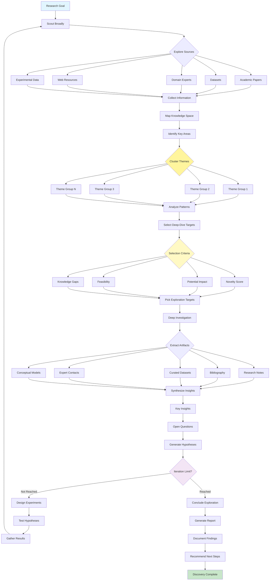

# Exploration and Discovery Pattern

Visual Diagram

## When to Use

- **Research projects**: Investigating new domains
- **Innovation initiatives**: Finding breakthrough opportunities
- **Problem spaces**: Understanding complex challenges
- **Knowledge gaps**: Identifying what's unknown
- **Competitive analysis**: Discovering market opportunities
- **Scientific research**: Generating and testing hypotheses

## Where It Fits

- **R&D departments**: New product development
- **Academic research**: Scientific investigation
- **Market research**: Opportunity identification
- **Drug discovery**: Pharmaceutical research
- **Technology scouting**: Emerging tech exploration

## Pros

- **Innovation enablement**: Discovers new possibilities
- **Comprehensive coverage**: Broad exploration of space
- **Pattern recognition**: Identifies hidden connections
- **Hypothesis generation**: Creates testable theories
- **Knowledge building**: Accumulates domain expertise
- **Serendipity**: Enables unexpected discoveries
- **Systematic approach**: Structured exploration process

## Cons

- **Time intensive**: Exploration takes significant time
- **Resource heavy**: Requires substantial compute/data
- **Uncertain outcomes**: No guaranteed discoveries
- **Scope creep**: Can expand beyond boundaries
- **Information overload**: Managing vast amounts of data
- **Direction challenges**: Deciding where to focus
- **ROI uncertainty**: Value may not be immediate

## Real-World Examples

1. **Drug Discovery Platform**:
   - Literature mining for drug targets
   - Chemical space exploration
   - Side effect pattern analysis
   - Clinical trial data mining
   - Hypothesis generation for compounds
   - Experimental design optimization

2. **Market Opportunity Finder**:
   - Consumer trend analysis
   - Competitor landscape mapping
   - Technology convergence identification
   - Unmet need discovery
   - Business model innovation
   - Partnership opportunity scouting

3. **Scientific Research Assistant**:
   - Literature review automation
   - Cross-discipline connection finding
   - Experimental design suggestions
   - Data pattern discovery
   - Hypothesis generation
   - Collaboration network building

4. **Technology Innovation Scout**:
   - Patent landscape analysis
   - Emerging technology tracking
   - Research lab monitoring
   - Startup ecosystem mapping
   - Technical feasibility assessment
   - Innovation opportunity ranking

5. **Intelligence Analysis System**:
   - Open source intelligence gathering
   - Pattern recognition across sources
   - Threat landscape mapping
   - Anomaly detection
   - Predictive modeling
   - Strategic assessment generation

6. **Educational Research Platform**:
   - Learning method exploration
   - Curriculum gap analysis
   - Student performance patterns
   - Pedagogical innovation discovery
   - Best practice identification
   - Intervention strategy development