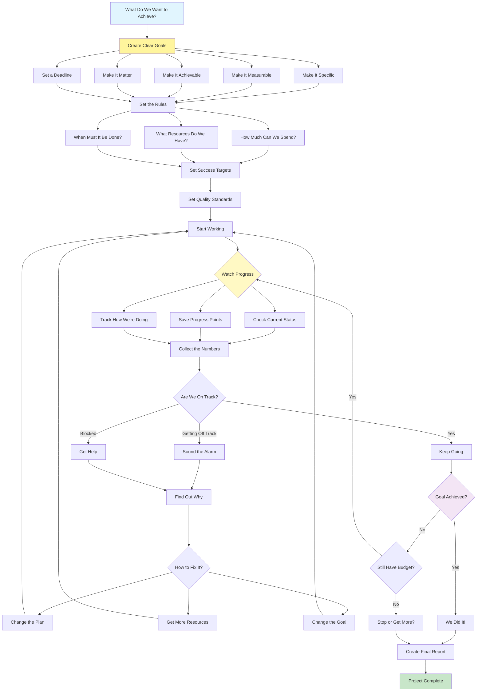

# Goal Setting and Monitoring Pattern

Visual Diagram

## When to Use

- **Autonomous operations**: When agents work independently toward objectives
- **Complex projects**: Multi-step tasks requiring progress tracking
- **Resource management**: When operating within constraints
- **Performance optimization**: Achieving specific measurable outcomes
- **Compliance requirements**: Meeting SLAs and quality standards
- **Strategic execution**: Aligning agent actions with business goals

## Where It Fits

- **Project automation**: Managing project milestones and deliverables
- **Sales pipelines**: Tracking targets and conversion goals
- **Content production**: Meeting publishing schedules and quality standards
- **System optimization**: Achieving performance benchmarks
- **Cost management**: Operating within budget constraints

## Pros

- **Purpose-driven**: Agents work toward clear objectives
- **Self-assessment**: Continuous evaluation of progress
- **Adaptability**: Dynamic adjustment to changing conditions
- **Accountability**: Clear metrics and success criteria
- **Resource efficiency**: Optimal allocation based on priorities
- **Early warning**: Proactive detection of issues
- **Measurable outcomes**: Quantifiable success metrics

## Cons

- **Overhead complexity**: Goal management adds system complexity
- **Rigid constraints**: May limit creative problem-solving
- **Measurement challenges**: Some goals are hard to quantify
- **False metrics**: Risk of optimizing wrong indicators
- **Resource intensive**: Continuous monitoring requires resources
- **Goal conflicts**: Multiple goals may compete
- **Over-optimization**: May sacrifice quality for metrics

## Real-World Examples

1. **Sales Automation System**:
   - Monthly revenue targets with daily tracking
   - Lead conversion rate goals
   - Customer acquisition cost limits
   - Activity metrics (calls, emails, meetings)
   - Automatic escalation for at-risk deals
   - Performance dashboard generation

2. **Content Publishing Platform**:
   - Article publication schedules
   - Quality score thresholds
   - SEO performance targets
   - Engagement metrics goals
   - Budget allocation per content type
   - Deadline management with alerts

3. **DevOps Pipeline**:
   - Deployment frequency targets
   - Mean time to recovery (MTTR) goals
   - Test coverage requirements
   - Performance benchmarks
   - Cost per deployment limits
   - Automatic rollback on metric violations

4. **Customer Service Center**:
   - First response time SLAs
   - Resolution rate targets
   - Customer satisfaction scores
   - Ticket volume management
   - Cost per interaction limits
   - Escalation thresholds

5. **Marketing Campaign Manager**:
   - ROI targets per campaign
   - Conversion rate goals
   - Budget allocation limits
   - A/B test success criteria
   - Channel performance metrics
   - Real-time optimization triggers

6. **Supply Chain Optimization**:
   - Inventory level targets
   - Order fulfillment SLAs
   - Cost reduction goals
   - Delivery time objectives
   - Quality compliance rates
   - Automatic reorder triggers