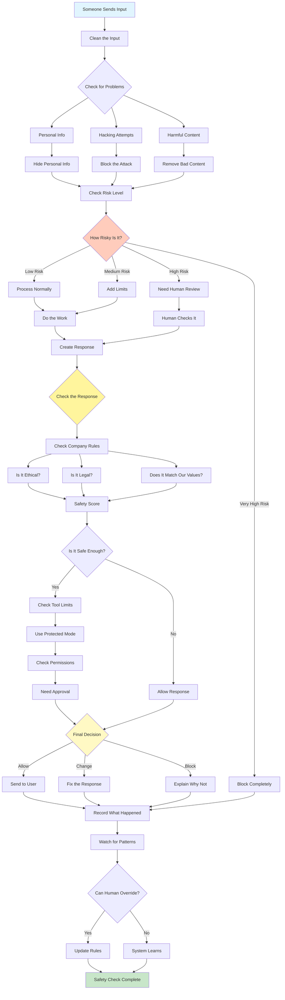

# Guardrails/Safety Patterns

Visual Diagram

## When to Use

- **Public-facing systems**: Protecting users from harmful content
- **Regulated industries**: Ensuring compliance with laws
- **Brand protection**: Maintaining company reputation
- **Data privacy**: Protecting sensitive information
- **Security requirements**: Preventing system exploitation
- **Ethical AI**: Ensuring responsible AI behavior

## Where It Fits

- **Chatbots and assistants**: Customer-facing AI systems
- **Content generation**: Automated content creation
- **Healthcare AI**: Medical advice and diagnosis
- **Financial services**: Trading and advisory systems
- **Educational platforms**: Student-facing AI tools

## Pros

- **Risk mitigation**: Prevents harmful outputs
- **Compliance**: Meets regulatory requirements
- **Brand protection**: Maintains reputation
- **User safety**: Protects from inappropriate content
- **Security**: Prevents exploitation attempts
- **Consistency**: Uniform safety standards
- **Auditability**: Clear safety decision trails

## Cons

- **False positives**: May block legitimate requests
- **Latency increase**: Safety checks add processing time
- **User frustration**: Over-restrictive filtering
- **Complexity**: Multiple layers of checks
- **Maintenance burden**: Policies need regular updates
- **Context blindness**: May miss nuanced safety issues
- **Cost overhead**: Additional processing and monitoring

## Real-World Examples

1. **Social Media AI Moderator**:
   - Hate speech detection and filtering
   - PII redaction in user posts
   - Misinformation flagging
   - Violence/graphic content blocking
   - Copyright violation detection
   - Appeal process for false positives

2. **Healthcare Chatbot**:
   - Medical advice disclaimers
   - Emergency situation detection
   - Drug interaction warnings
   - Privacy protection for health data
   - Scope limitations enforcement
   - Professional referral triggers

3. **Financial Advisory AI**:
   - Investment risk warnings
   - Regulatory compliance checks
   - Insider trading prevention
   - Client suitability verification
   - Market manipulation detection
   - Audit trail maintenance

4. **Educational AI Tutor**:
   - Age-appropriate content filtering
   - Academic integrity protection
   - Bullying/harassment prevention
   - Personal information protection
   - Inappropriate topic blocking
   - Parent/teacher override options

5. **Enterprise AI Assistant**:
   - Data classification enforcement
   - Access control verification
   - Confidentiality protection
   - Compliance checking
   - Security threat detection
   - Activity logging and monitoring

6. **Content Generation Platform**:
   - Copyright infringement prevention
   - Trademark protection
   - Defamation blocking
   - Bias detection and mitigation
   - Fact-checking integration
   - Quality standards enforcement