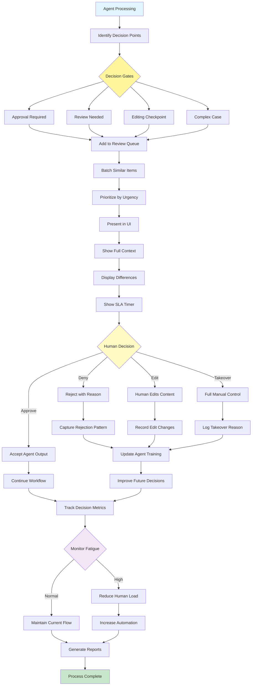

# Human-in-the-Loop (HITL) Pattern

Visual Diagram

## When to Use

- **High-stakes decisions**: When errors have significant consequences
- **Regulatory compliance**: Required human oversight for legal reasons
- **Quality assurance**: Ensuring output meets standards
- **Edge cases**: Handling unusual or ambiguous situations
- **Training data generation**: Using human feedback to improve
- **Trust building**: Gradual automation with human validation

## Where It Fits

- **Content moderation**: Reviewing sensitive or borderline content
- **Medical diagnosis**: Physician verification of AI recommendations
- **Financial approvals**: Human authorization for large transactions
- **Legal document review**: Attorney oversight of contracts
- **Hiring decisions**: Human review of AI-screened candidates

## Pros

- **Quality assurance**: Human judgment catches AI errors
- **Compliance**: Meets regulatory requirements
- **Learning source**: Human feedback improves system
- **Trust**: Users confident in human oversight
- **Flexibility**: Humans handle edge cases well
- **Accountability**: Clear responsibility chain
- **Risk mitigation**: Prevents costly mistakes

## Cons

- **Scalability limits**: Human bandwidth constrains throughput
- **Cost increase**: Human reviewers are expensive
- **Latency addition**: Waiting for human response delays process
- **Inconsistency**: Different humans make different decisions
- **Fatigue effects**: Quality degrades with reviewer tiredness
- **Training requirements**: Reviewers need domain expertise
- **Availability issues**: 24/7 coverage is challenging

## Real-World Examples

1. **Content Moderation Platform**:
   - AI flags potentially problematic content
   - Human reviewers make final decisions
   - Complex cases escalated to senior moderators
   - Reviewer feedback trains AI models
   - Fatigue monitoring and rotation schedules

2. **Loan Approval System**:
   - AI assesses credit risk
   - Human reviews borderline applications
   - Large loans require manual approval
   - Explanations provided for denials
   - Audit trail for compliance

3. **Medical Imaging Analysis**:
   - AI detects potential abnormalities
   - Radiologist confirms diagnoses
   - Critical findings prioritized for review
   - Second opinions for complex cases
   - Continuous learning from corrections

4. **Resume Screening**:
   - AI filters initial applications
   - HR reviews shortlisted candidates
   - Diversity checks by humans
   - Feedback improves screening algorithms
   - Final interviews always human-led

5. **Translation Quality Control**:
   - AI performs initial translation
   - Human linguists review and edit
   - Cultural sensitivity checks
   - Technical terminology verification
   - Style consistency enforcement

6. **Autonomous Vehicle Monitoring**:
   - AI handles normal driving
   - Remote operators handle edge cases
   - Safety driver takeover capability
   - Incident review and analysis
   - Continuous improvement from interventions