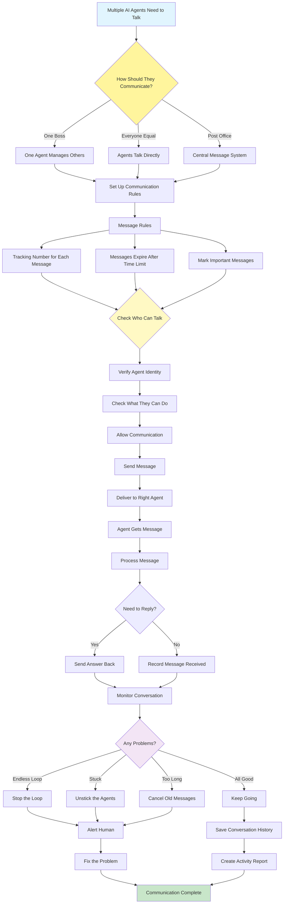

# Inter-Agent Communication (A2A) Pattern

Visual Diagram

## When to Use

- **Complex workflows**: Tasks requiring multiple specialized agents
- **Modular systems**: Building composable agent architectures
- **Distributed processing**: Agents running in different locations
- **Scalable architectures**: Systems that need to grow
- **Collaborative tasks**: Agents working together on problems
- **Service-oriented design**: Agents as microservices

## Where It Fits

- **Enterprise automation**: Coordinating business process agents
- **Research systems**: Agents collaborating on analysis
- **Content production**: Pipeline of content creation agents
- **Trading systems**: Agents coordinating financial decisions
- **Smart city systems**: IoT and service agents communicating

## Pros

- **Modularity**: Clear separation of agent responsibilities
- **Scalability**: Easy to add new agents to the system
- **Flexibility**: Different communication patterns available
- **Fault isolation**: Agent failures don't crash system
- **Reusability**: Agents can be reused in different workflows
- **Debugging support**: Message tracing aids troubleshooting
- **Parallel processing**: Agents can work simultaneously

## Cons

- **Complexity overhead**: Communication protocols add complexity
- **Latency accumulation**: Message passing adds delays
- **Coordination challenges**: Managing agent interactions
- **Debugging difficulty**: Tracing distributed conversations
- **State management**: Maintaining consistency across agents
- **Network dependencies**: Vulnerable to communication failures
- **Security concerns**: Inter-agent authentication needed

## Real-World Examples

1. **E-commerce Order Processing**:
   - Inventory Agent checks stock availability
   - Pricing Agent calculates total costs
   - Payment Agent processes transactions
   - Shipping Agent arranges delivery
   - Notification Agent updates customer
   - Orchestrator coordinates entire flow

2. **News Production Pipeline**:
   - Crawler Agent gathers news sources
   - Fact-Check Agent verifies information
   - Writer Agent creates articles
   - Editor Agent reviews content
   - Publisher Agent posts to CMS
   - Analytics Agent tracks performance

3. **Financial Analysis Platform**:
   - Data Agent collects market information
   - Technical Agent performs chart analysis
   - Fundamental Agent analyzes financials
   - Risk Agent assesses portfolio exposure
   - Report Agent generates recommendations
   - Compliance Agent ensures regulations

4. **Smart Manufacturing System**:
   - Sensor Agents monitor equipment
   - Quality Agents check production
   - Maintenance Agents schedule repairs
   - Inventory Agents manage supplies
   - Planning Agents optimize schedules
   - Control Agent coordinates operations

5. **Healthcare Coordination**:
   - Triage Agent assesses symptoms
   - Diagnostic Agent suggests tests
   - Specialist Agents provide expertise
   - Treatment Agent recommends therapy
   - Pharmacy Agent manages medications
   - Scheduler Agent books appointments

6. **Research Collaboration Platform**:
   - Literature Agent searches papers
   - Data Agent manages datasets
   - Analysis Agent runs experiments
   - Visualization Agent creates charts
   - Writing Agent drafts reports
   - Review Agent checks quality