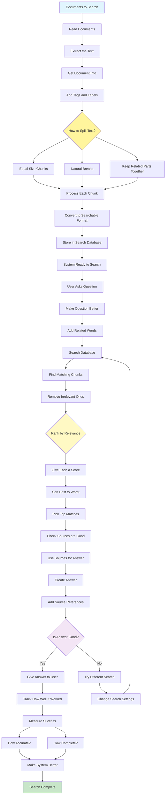

# Knowledge Retrieval (RAG) Pattern

Visual Diagram

## When to Use

- **Dynamic knowledge needs**: Accessing up-to-date information
- **Large document collections**: Querying extensive knowledge bases
- **Domain-specific applications**: Specialized knowledge integration
- **Factual accuracy requirements**: Grounding responses in sources
- **Citation requirements**: Providing verifiable references
- **Reducing hallucinations**: Ensuring factual responses

## Where It Fits

- **Enterprise search**: Internal document retrieval systems
- **Customer support**: Knowledge base querying
- **Research assistants**: Academic paper retrieval
- **Legal research**: Case law and statute searching
- **Technical documentation**: API and product documentation access

## Pros

- **Accuracy**: Responses grounded in real sources
- **Verifiability**: Citations enable fact-checking
- **Scalability**: Handle vast document collections
- **Currency**: Access to latest information
- **Domain expertise**: Specialized knowledge integration
- **Reduced hallucination**: Less fabrication of facts
- **Flexibility**: Easy to update knowledge base

## Cons

- **Infrastructure needs**: Requires vector databases and storage
- **Processing overhead**: Embedding and indexing costs
- **Retrieval quality**: Dependent on chunking and matching
- **Context limitations**: Retrieved chunks may lack context
- **Latency**: Additional retrieval step adds delay
- **Maintenance**: Knowledge base needs regular updates
- **Relevance challenges**: May retrieve irrelevant information

## Real-World Examples

1. **Enterprise Knowledge Management**:
   - Index company policies and procedures
   - Retrieve relevant HR guidelines
   - Search technical documentation
   - Access historical project data
   - Provide sourced answers to employees

2. **Legal Research Platform**:
   - Index case law and statutes
   - Retrieve relevant precedents
   - Search legal commentary
   - Find similar cases
   - Generate briefs with citations

3. **Medical Information System**:
   - Index medical literature
   - Retrieve treatment guidelines
   - Search drug interactions
   - Access clinical trials data
   - Provide evidence-based recommendations

4. **Academic Research Assistant**:
   - Index research papers
   - Retrieve relevant studies
   - Search across disciplines
   - Find citation networks
   - Generate literature reviews

5. **Technical Support System**:
   - Index product documentation
   - Retrieve troubleshooting guides
   - Search error code databases
   - Access configuration examples
   - Provide solution steps with references

6. **News Aggregation Service**:
   - Index news articles in real-time
   - Retrieve relevant coverage
   - Search historical archives
   - Find related stories
   - Generate summaries with sources