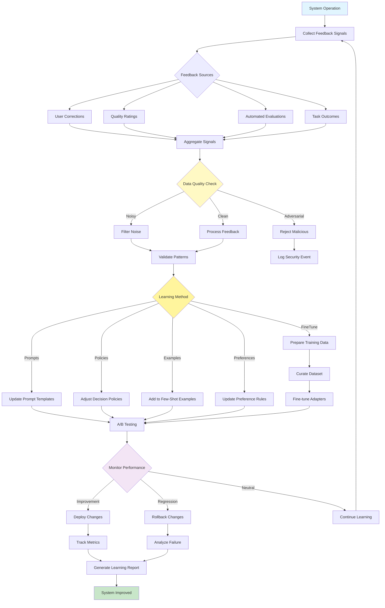

# Learning and Adaptation Pattern

Visual Diagram

## When to Use

- **Performance optimization**: When system needs to improve over time
- **User personalization**: Adapting to individual user preferences
- **Error reduction**: Learning from mistakes to prevent repetition
- **Domain specialization**: Building expertise in specific areas
- **Dynamic environments**: Adapting to changing conditions
- **Feedback incorporation**: When user corrections are available

## Where It Fits

- **Customer service**: Learning from resolved tickets and satisfaction scores
- **Content recommendation**: Adapting to user engagement patterns
- **Code assistants**: Learning from code review feedback
- **Educational systems**: Adapting to student learning patterns
- **Decision support**: Improving predictions based on outcomes

## Pros

- **Continuous improvement**: System gets better with use
- **Personalization**: Adapts to specific users or domains
- **Error reduction**: Learns to avoid past mistakes
- **Efficiency gains**: Optimizes common patterns over time
- **Robustness**: Adapts to changing requirements
- **User satisfaction**: Better alignment with expectations
- **Knowledge retention**: Preserves learned improvements

## Cons

- **Feedback quality**: Dependent on reliable feedback signals
- **Training costs**: Fine-tuning and testing require resources
- **Regression risks**: Changes might degrade performance
- **Complexity**: Managing learning pipelines is challenging
- **Data requirements**: Needs sufficient feedback volume
- **Adversarial risks**: Vulnerable to poisoning attacks
- **Drift management**: Must handle concept drift over time

## Real-World Examples

1. **Customer Support Chatbot**:
   - Learns from agent takeovers and corrections
   - Adapts responses based on satisfaction ratings
   - Updates FAQ answers from successful resolutions
   - Improves intent classification from mislabeled queries
   - Personalizes tone based on customer feedback

2. **Code Review Assistant**:
   - Learns from accepted/rejected suggestions
   - Adapts to team coding standards
   - Improves based on developer feedback
   - Updates patterns from merged pull requests
   - Learns project-specific conventions

3. **Content Writing Assistant**:
   - Learns from editor corrections
   - Adapts to brand voice guidelines
   - Improves SEO strategies from performance data
   - Updates style based on engagement metrics
   - Personalizes for different content types

4. **Financial Advisory System**:
   - Learns from investment outcomes
   - Adapts to market conditions
   - Improves predictions from historical data
   - Updates risk models from losses
   - Personalizes strategies per client profile

5. **Medical Diagnosis Assistant**:
   - Learns from confirmed diagnoses
   - Adapts to local disease patterns
   - Improves from physician corrections
   - Updates protocols from new research
   - Personalizes for patient demographics

6. **E-commerce Recommendation Engine**:
   - Learns from purchase behavior
   - Adapts to seasonal trends
   - Improves from return/review data
   - Updates preferences from browsing patterns
   - Personalizes for individual shoppers