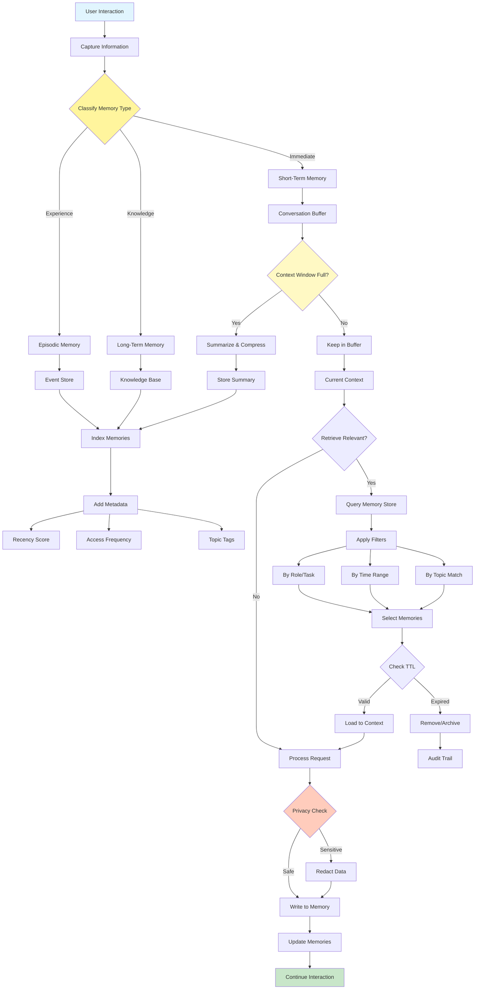

# Memory Management Pattern

Visual Diagram

## When to Use

- **Conversational continuity**: Maintaining context across interactions
- **Personalization**: Remembering user preferences and history
- **Learning systems**: Accumulating knowledge over time
- **Complex workflows**: Tracking state across multiple steps
- **User sessions**: Managing multi-turn conversations
- **Knowledge accumulation**: Building domain expertise over time

## Where It Fits

- **Customer service bots**: Remembering previous interactions and issues
- **Personal assistants**: Tracking user preferences and routines
- **Educational tutors**: Remembering student progress and weaknesses
- **Project management**: Maintaining project context and history
- **Research assistants**: Accumulating findings across sessions

## Pros

- **Context preservation**: Maintains conversation continuity
- **Personalization**: Enables tailored responses based on history
- **Learning capability**: Improves performance through experience
- **Efficiency**: Avoids repeating previous work
- **User experience**: More natural, human-like interactions
- **Knowledge building**: Accumulates valuable information over time
- **State management**: Handles complex multi-step processes

## Cons

- **Storage costs**: Memory systems require database infrastructure
- **Privacy concerns**: Storing user data raises privacy issues
- **Context window limits**: Must manage finite token budgets
- **Retrieval complexity**: Finding relevant memories can be challenging
- **Data staleness**: Old memories may become outdated or irrelevant
- **Synchronization issues**: Managing memory across distributed systems
- **Performance overhead**: Memory operations add latency

## Real-World Examples

1. **Customer Support System**:
   - Short-term: Current conversation context
   - Episodic: Previous support tickets and resolutions
   - Long-term: Customer preferences and history
   - Automatic summarization of long conversations
   - Privacy-compliant data retention policies

2. **Personal Shopping Assistant**:
   - Short-term: Current shopping session
   - Episodic: Past purchases and returns
   - Long-term: Style preferences and sizes
   - Seasonal preference tracking
   - Budget and spending pattern memory

3. **Code Development Assistant**:
   - Short-term: Current coding session
   - Episodic: Recent bug fixes and features
   - Long-term: Project architecture and conventions
   - Technology stack preferences
   - Common error patterns and solutions

4. **Medical Consultation Bot**:
   - Short-term: Current symptoms discussion
   - Episodic: Recent appointments and treatments
   - Long-term: Medical history and allergies
   - Medication tracking
   - HIPAA-compliant data handling

5. **Educational Tutor**:
   - Short-term: Current lesson context
   - Episodic: Recent quiz results and assignments
   - Long-term: Learning style and pace
   - Concept mastery tracking
   - Common mistake patterns

6. **Project Management Assistant**:
   - Short-term: Current task discussion
   - Episodic: Recent meetings and decisions
   - Long-term: Project goals and constraints
   - Team member preferences
   - Historical project patterns