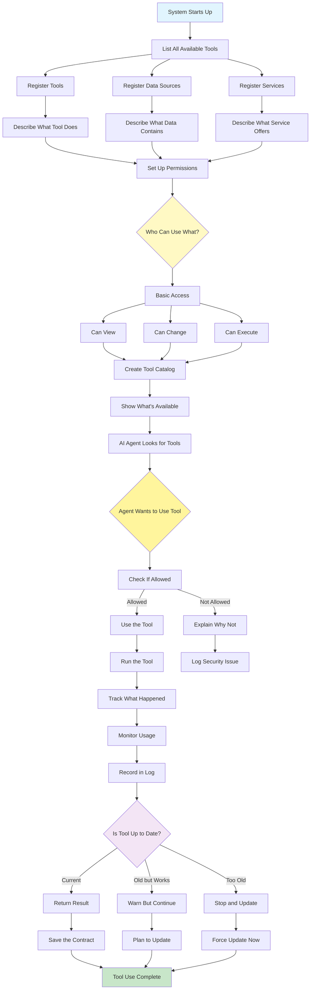

# Model Context Protocol (MCP) Pattern

Visual Diagram

## When to Use

- **Enterprise systems**: Building scalable, production-grade AI applications
- **Multi-tool integration**: Connecting to diverse external resources
- **Standardization needs**: Ensuring consistent communication interfaces
- **Security requirements**: Managing access control and permissions
- **Dynamic environments**: Resources that change or evolve over time
- **Interoperability**: Enabling different AI systems to work together

## Where It Fits

- **Enterprise AI platforms**: Standardizing tool and data access
- **Multi-vendor integrations**: Connecting different AI services
- **Microservices architectures**: AI agents accessing distributed services
- **Cloud-native applications**: Managing resources across environments
- **API gateways**: Centralizing AI system access to external resources

## Pros

- **Standardization**: Universal interface for all integrations
- **Discoverability**: Agents can dynamically find available resources
- **Security**: Built-in authentication and authorization
- **Versioning**: Graceful handling of API evolution
- **Observability**: Comprehensive logging and tracing
- **Reusability**: Write once, use across multiple agents
- **Scalability**: Designed for enterprise-grade deployments

## Cons

- **Implementation overhead**: Requires upfront protocol setup
- **Complexity**: Additional abstraction layer to manage
- **Learning curve**: Teams need to understand MCP concepts
- **Migration effort**: Existing integrations need conversion
- **Performance overhead**: Protocol layer adds latency
- **Vendor support**: Requires ecosystem adoption
- **Debugging complexity**: Additional layer in troubleshooting

## Real-World Examples

1. **Enterprise Data Platform**:
   - Unified access to databases, APIs, and file systems
   - Role-based access control for different teams
   - Audit logging for compliance requirements
   - Version management for schema evolution
   - Discovery service for available data sources

2. **Multi-Cloud AI Services**:
   - Standardized interface to AWS, Azure, GCP services
   - Credential management and rotation
   - Service discovery across cloud providers
   - Cost tracking and resource optimization
   - Failover and redundancy handling

3. **Healthcare AI System**:
   - HIPAA-compliant data access protocols
   - Patient data privacy controls
   - Medical device integrations
   - Electronic health record connections
   - Audit trails for regulatory compliance

4. **Financial Services Platform**:
   - Market data feed integrations
   - Trading system connections
   - Risk management tool access
   - Compliance checking services
   - Transaction audit logging

5. **Manufacturing IoT Integration**:
   - Sensor data collection protocols
   - Equipment control interfaces
   - Quality assurance system connections
   - Supply chain data access
   - Predictive maintenance tools

6. **Research Computing Platform**:
   - Scientific database access
   - Compute cluster job submission
   - Experiment tracking systems
   - Collaboration tool integrations
   - Version control for research artifacts