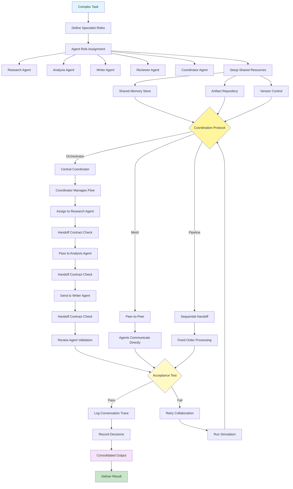

# Multi-Agent Collaboration Pattern

Visual Diagram

## When to Use

- **Complex, multi-faceted problems**: Tasks requiring diverse expertise
- **Parallel workstreams**: When subtasks can be handled simultaneously
- **Specialized knowledge requirements**: Different aspects need different skills
- **Scale and efficiency**: Large projects benefiting from division of labor
- **Quality through specialization**: When expertise depth matters
- **Iterative refinement**: Tasks requiring multiple perspectives

## Where It Fits

- **Software development teams**: Design, coding, testing, documentation agents
- **Content production pipelines**: Research, writing, editing, publishing agents
- **Financial analysis**: Data collection, analysis, risk assessment, reporting agents
- **Customer service**: Triage, technical, billing, escalation agents
- **Research projects**: Literature review, experimentation, analysis, synthesis agents

## Pros

- **Specialization benefits**: Each agent optimized for specific tasks
- **Parallel processing**: Multiple agents work simultaneously
- **Scalability**: Easy to add new specialist agents
- **Modularity**: Agents can be developed and updated independently
- **Robustness**: Failure of one agent doesn't crash entire system
- **Knowledge separation**: Clear boundaries between domains
- **Quality improvement**: Multiple perspectives and validation steps

## Cons

- **Coordination complexity**: Managing inter-agent communication is challenging
- **Overhead costs**: Multiple agents mean multiple API calls and resources
- **Context management**: Maintaining shared understanding across agents
- **Debugging difficulty**: Tracing issues across multiple agents
- **Latency accumulation**: Handoffs between agents add delays
- **Conflict resolution**: Agents may disagree or produce incompatible outputs
- **State synchronization**: Keeping shared memory consistent

## Real-World Examples

1. **Automated News Production**:
   - News Gatherer Agent: Collects breaking news from sources
   - Fact Checker Agent: Verifies claims and sources
   - Writer Agent: Drafts article with proper structure
   - Editor Agent: Improves clarity and style
   - SEO Agent: Optimizes for search engines
   - Publisher Agent: Formats and publishes to CMS

2. **Investment Analysis System**:
   - Market Data Agent: Gathers real-time market information
   - Fundamental Analysis Agent: Evaluates company financials
   - Technical Analysis Agent: Analyzes price patterns
   - Risk Assessment Agent: Calculates portfolio risks
   - Report Generator Agent: Creates investment recommendations
   - Compliance Agent: Ensures regulatory compliance

3. **E-commerce Product Launch**:
   - Market Research Agent: Analyzes competition and demand
   - Product Description Agent: Creates compelling copy
   - Pricing Agent: Determines optimal pricing strategy
   - Inventory Agent: Manages stock levels
   - Marketing Agent: Plans promotional campaigns
   - Customer Service Agent: Prepares FAQ and support materials

4. **Legal Document Review**:
   - Document Parser Agent: Extracts key information
   - Clause Analysis Agent: Identifies important terms
   - Risk Identifier Agent: Flags potential issues
   - Compliance Checker Agent: Ensures regulatory adherence
   - Summary Generator Agent: Creates executive summaries
   - Recommendation Agent: Suggests modifications

5. **Software Bug Resolution**:
   - Bug Triage Agent: Categorizes and prioritizes issues
   - Code Analysis Agent: Identifies affected components
   - Solution Designer Agent: Proposes fixes
   - Implementation Agent: Generates patch code
   - Testing Agent: Creates and runs test cases
   - Documentation Agent: Updates docs and release notes

6. **Academic Paper Review**:
   - Literature Review Agent: Finds related work
   - Methodology Critic Agent: Evaluates research methods
   - Statistical Validator Agent: Checks calculations
   - Writing Quality Agent: Assesses clarity and structure
   - Citation Checker Agent: Verifies references
   - Summary Writer Agent: Creates review summary