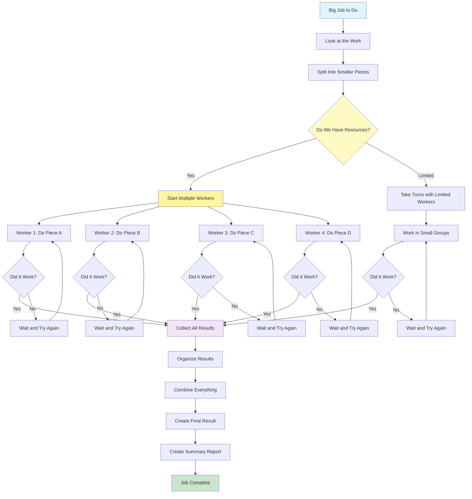

# Parallelization Pattern

Visual Diagram

## When to Use

- **Large-scale data processing**: When processing multiple documents, records, or data sources
- **Time-sensitive operations**: When results are needed quickly and tasks are independent
- **Batch operations**: When performing the same operation on multiple items
- **Web scraping/crawling**: When gathering data from multiple sources simultaneously
- **Multi-document analysis**: When analyzing multiple files or documents independently
- **API aggregation**: When calling multiple APIs that don't depend on each other

## Where It Fits

- **Document processing pipelines**: Analyzing multiple PDFs or reports simultaneously
- **Data enrichment workflows**: Enhancing records from multiple data sources
- **Content generation**: Creating multiple variations or translations in parallel
- **Research automation**: Searching multiple databases or sources concurrently
- **Testing frameworks**: Running multiple test scenarios simultaneously

## Pros

- **Speed improvement**: Dramatic reduction in total processing time
- **Resource utilization**: Better use of available computational resources
- **Scalability**: Easy to scale up or down based on workload
- **Fault isolation**: Failure in one worker doesn't affect others
- **Progress tracking**: Can show incremental progress as workers complete
- **Flexibility**: Can dynamically adjust worker count based on load
- **Cost efficiency**: Optimize resource usage and reduce idle time

## Cons

- **Complexity increase**: Managing multiple concurrent processes is challenging
- **Resource limits**: API rate limits and quotas constrain parallelization
- **Coordination overhead**: Synchronization and result merging add complexity
- **Debugging difficulty**: Harder to trace issues in parallel execution
- **Cost multiplication**: Multiple simultaneous API calls increase costs
- **Memory usage**: Holding multiple results in memory can be resource-intensive
- **Ordering challenges**: Maintaining sequence when needed requires extra logic

## Real-World Examples

1. **News Aggregation Service**:
   - Simultaneously fetch articles from 50+ news sources
   - Each worker processes one news source
   - Rate limit to 10 concurrent API calls
   - Merge and deduplicate results
   - Sort by relevance and timestamp

2. **E-commerce Price Monitoring**:
   - Monitor prices across 100+ competitor sites
   - Parallel workers scrape product pages
   - Handle retry logic for failed requests
   - Aggregate pricing data into comparison matrix
   - Generate price change alerts

3. **Document Intelligence System**:
   - Process 1000+ page legal document set
   - Split into 50-page chunks for parallel analysis
   - Each worker extracts entities and clauses
   - Merge findings into comprehensive report
   - Track document provenance for each finding

4. **Social Media Analytics**:
   - Analyze mentions across Twitter, LinkedIn, Facebook, Instagram
   - Parallel workers for each platform
   - Apply sentiment analysis to each mention
   - Aggregate into unified dashboard
   - Generate trend reports with platform breakdown

5. **Code Repository Analysis**:
   - Scan entire codebase for security vulnerabilities
   - Parallel workers analyze different directories
   - Each worker runs different security checks
   - Collect and prioritize all findings
   - Generate comprehensive security report

6. **Multi-language Translation Project**:
   - Translate documentation into 15 languages
   - Parallel workers for each language pair
   - Maintain consistency with translation memory
   - Quality check each translation
   - Compile into multi-language documentation set