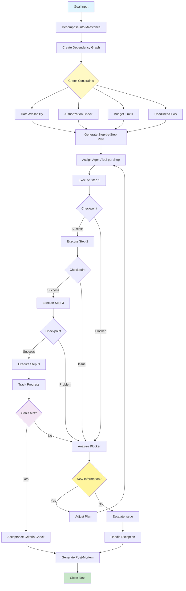

# Planning Pattern

Visual Diagram

## When to Use

- **Complex multi-step projects**: When tasks have multiple dependencies and phases
- **Goal-oriented workflows**: When working toward specific, measurable objectives
- **Resource-constrained operations**: When managing budgets, time, or computational limits
- **Uncertain environments**: When adaptability to changing conditions is needed
- **Collaborative tasks**: When coordinating multiple agents or tools
- **Long-running processes**: When tasks span extended timeframes

## Where It Fits

- **Project management automation**: Breaking down projects into executable tasks
- **Software development**: Planning features from requirements to deployment
- **Research projects**: Organizing literature review, experimentation, and analysis
- **Content production**: Planning multi-part content series or campaigns
- **Business process automation**: Orchestrating complex business workflows

## Pros

- **Strategic execution**: Transforms reactive agents into proactive planners
- **Dependency management**: Handles complex task interdependencies
- **Resource optimization**: Allocates resources efficiently across steps
- **Adaptability**: Can adjust plans based on new information
- **Progress visibility**: Clear tracking of milestone completion
- **Risk mitigation**: Early identification of blockers and issues
- **Reusability**: Plans can be templated and reused

## Cons

- **Upfront overhead**: Planning phase adds initial latency
- **Rigidity risk**: Over-planning can reduce flexibility
- **Complexity**: Managing plan state and dependencies is challenging
- **Prediction errors**: Initial plans may be based on incorrect assumptions
- **Replanning costs**: Adjusting plans mid-execution can be expensive
- **Context limitations**: Long plans may exceed context windows
- **Coordination overhead**: Managing multiple agents increases complexity

## Real-World Examples

1. **Software Feature Development**:
   - Requirements analysis and design
   - Development task breakdown
   - Testing strategy planning
   - Deployment scheduling
   - Documentation preparation
   - Rollback planning

2. **Marketing Campaign Execution**:
   - Market research and analysis
   - Content creation schedule
   - Channel selection and timing
   - Budget allocation
   - Performance monitoring setup
   - A/B testing plans

3. **Academic Research Project**:
   - Literature review planning
   - Hypothesis formulation
   - Experiment design
   - Data collection schedule
   - Analysis methodology
   - Publication timeline

4. **Data Migration Project**:
   - Data audit and mapping
   - Schema design
   - Migration script development
   - Testing phases
   - Rollout schedule
   - Validation checkpoints

5. **Product Launch Planning**:
   - Development milestones
   - Marketing preparation
   - Sales enablement
   - Support documentation
   - Launch event coordination
   - Post-launch monitoring

6. **Compliance Audit Preparation**:
   - Requirement identification
   - Document gathering
   - Gap analysis
   - Remediation planning
   - Review scheduling
   - Report generation