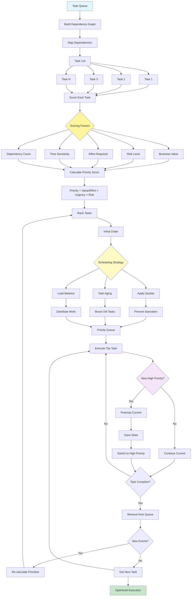

# Prioritization Pattern

Visual Diagram

## When to Use

- **Resource constraints**: Limited processing capacity
- **Multiple objectives**: Competing goals and tasks
- **Dynamic environments**: Constantly changing priorities
- **Complex dependencies**: Tasks with interdependencies
- **Time-sensitive operations**: Deadline-driven work
- **Fair scheduling**: Preventing task starvation

## Where It Fits

- **Task management systems**: Workflow orchestration
- **Customer service**: Ticket prioritization
- **Manufacturing**: Production scheduling
- **Healthcare**: Patient triage systems
- **DevOps**: Deployment and maintenance prioritization

## Pros

- **Efficiency**: Optimal use of resources
- **Responsiveness**: High-priority items handled first
- **Fairness**: Prevents indefinite delays
- **Adaptability**: Adjusts to changing conditions
- **Transparency**: Clear prioritization logic
- **Goal alignment**: Tasks ranked by business value
- **Scalability**: Handles growing task queues

## Cons

- **Complexity**: Priority calculation can be complex
- **Overhead**: Continuous reordering costs resources
- **Starvation risk**: Low-priority tasks may wait forever
- **Context switching**: Preemption adds overhead
- **Subjective scoring**: Priority factors may be disputed
- **Dependencies**: Complex dependency management
- **Prediction errors**: Effort estimates may be wrong

## Real-World Examples

1. **Customer Support System**:
   - Premium customers get priority
   - Urgent issues ranked higher
   - Age-based escalation
   - Skill-based routing
   - SLA compliance tracking
   - Load balancing across agents

2. **Software Development Pipeline**:
   - Critical bugs prioritized
   - Feature value scoring
   - Technical debt scheduling
   - Dependency resolution
   - Sprint capacity planning
   - Resource allocation

3. **Healthcare Triage**:
   - Emergency severity scoring
   - Wait time consideration
   - Resource availability
   - Specialist routing
   - Test result prioritization
   - Appointment scheduling

4. **Manufacturing Scheduler**:
   - Order value prioritization
   - Deadline management
   - Resource optimization
   - Setup time minimization
   - Quality requirements
   - Maintenance windows

5. **Content Publishing**:
   - Trending topic priority
   - Editorial calendar
   - Author availability
   - SEO value scoring
   - Social media timing
   - Cross-platform coordination

6. **Network Traffic Management**:
   - QoS packet prioritization
   - Bandwidth allocation
   - Latency-sensitive routing
   - Fair queuing
   - Emergency traffic priority
   - Load balancing