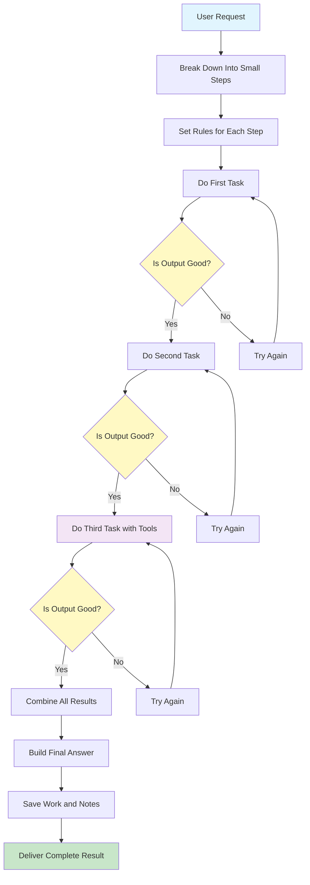

# Prompt Chaining Pattern

Visual Diagram

## When to Use

- **Complex multi-step processes**: When you need to break down a complex task into discrete, manageable steps
- **Data transformation pipelines**: When information needs to be processed through multiple stages with different requirements
- **Quality-critical workflows**: When each step's output must meet specific criteria before proceeding
- **Debugging requirements**: When you need clear visibility into each stage of processing
- **Mixed tool/AI operations**: When combining LLM calls with API calls, database queries, or other tools

## Where It Fits

- **Document processing pipelines**: Research → Analysis → Writing → Editing → Publishing
- **Data ETL workflows**: Extract → Transform → Validate → Load
- **Customer service flows**: Intent recognition → Information gathering → Solution generation → Response formatting
- **Code generation**: Requirements → Design → Implementation → Testing → Documentation
- **Content creation**: Ideation → Outline → Draft → Review → Finalization

## Pros

- **Modularity**: Each step can be developed, tested, and optimized independently
- **Debuggability**: Clear visibility into where failures occur in the chain
- **Reliability**: Structured data contracts ensure consistent handoffs between steps
- **Reusability**: Individual chain components can be reused in different workflows
- **Error handling**: Each step can have specific retry logic and fallback strategies
- **Incremental progress**: Partial results can be saved and resumed if interrupted
- **Parallel development**: Different team members can work on different chain segments

## Cons

- **Latency accumulation**: Each step adds processing time, leading to longer total execution
- **Context limitations**: Information might be lost or compressed between steps
- **Error propagation**: Mistakes early in the chain can cascade through subsequent steps
- **Complexity overhead**: Simple tasks might become over-engineered with unnecessary steps
- **Cost multiplication**: Each LLM call incurs costs, which accumulate across the chain
- **Rigid structure**: May be inflexible for tasks requiring dynamic adaptation
- **State management**: Requires careful handling of intermediate results and context

## Real-World Examples

1. **Legal Document Analysis**: 
   - Step 1: Extract key clauses from contracts
   - Step 2: Identify potential risks and obligations
   - Step 3: Compare against standard templates
   - Step 4: Generate executive summary with recommendations

2. **E-commerce Product Descriptions**:
   - Step 1: Extract product features from manufacturer data
   - Step 2: Research competitor descriptions and pricing
   - Step 3: Generate SEO-optimized description
   - Step 4: Create variations for different platforms
   - Step 5: Validate against brand guidelines

3. **Academic Research Assistant**:
   - Step 1: Parse research question and identify key concepts
   - Step 2: Search and retrieve relevant papers
   - Step 3: Extract and summarize findings
   - Step 4: Identify gaps and contradictions
   - Step 5: Generate literature review with citations

4. **Software Bug Analysis**:
   - Step 1: Parse error logs and stack traces
   - Step 2: Identify affected components
   - Step 3: Search for similar issues in knowledge base
   - Step 4: Generate potential solutions
   - Step 5: Create detailed bug report with reproduction steps

5. **Financial Report Generation**:
   - Step 1: Collect data from multiple sources
   - Step 2: Perform calculations and analysis
   - Step 3: Identify trends and anomalies
   - Step 4: Generate narrative explanations
   - Step 5: Format into regulatory-compliant report