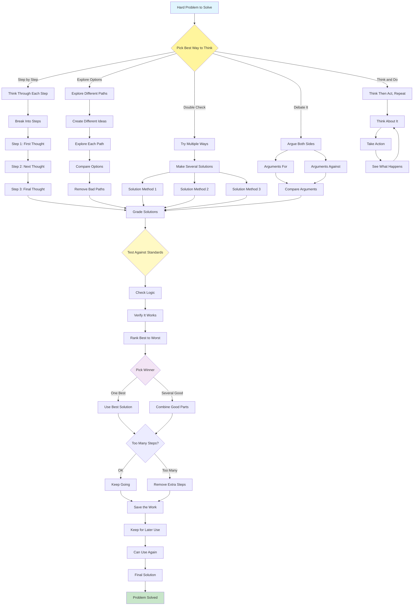

# Reasoning Techniques Pattern

Visual Diagram

## When to Use

- **Complex problem-solving**: Multi-step logical challenges
- **Mathematical reasoning**: Problems requiring systematic thinking
- **Strategic planning**: Evaluating multiple approaches
- **Critical analysis**: Deep examination of options
- **Decision making**: Weighing alternatives systematically
- **Creative exploration**: Generating diverse solutions

## Where It Fits

- **Research analysis**: Breaking down complex research questions
- **Code debugging**: Systematic problem identification
- **Business strategy**: Evaluating strategic options
- **Medical diagnosis**: Differential diagnosis reasoning
- **Legal analysis**: Building logical arguments

## Pros

- **Improved accuracy**: Systematic thinking reduces errors
- **Transparency**: Clear reasoning traces
- **Exploration**: Considers multiple solution paths
- **Robustness**: Multiple methods provide validation
- **Learning**: Reasoning traces help improvement
- **Flexibility**: Different techniques for different problems
- **Quality**: Higher quality solutions through deliberation

## Cons

- **Increased latency**: Multiple reasoning steps take time
- **Token consumption**: Verbose reasoning uses more tokens
- **Complexity**: Managing reasoning flows is challenging
- **Overthinking**: Can make simple problems complex
- **Context limits**: Long reasoning may exceed windows
- **Cost multiplication**: Multiple paths increase costs
- **Diminishing returns**: Extra reasoning may not help

## Real-World Examples

1. **Mathematical Problem Solver**:
   - Chain-of-Thought for step-by-step solutions
   - Self-consistency checking multiple approaches
   - Tree-of-Thoughts exploring solution branches
   - Validation through different methods
   - Clear explanation generation

2. **Strategic Business Advisor**:
   - Tree-of-Thoughts for strategy exploration
   - Debate between growth vs efficiency
   - Self-consistency across market analyses
   - ReAct pattern with data retrieval
   - Synthesis of best strategies

3. **Code Architecture Designer**:
   - Chain-of-Thought for design decisions
   - Tree exploration of architectures
   - Debate between design patterns
   - ReAct with code analysis tools
   - Reasoning persistence for documentation

4. **Medical Diagnostic System**:
   - Differential diagnosis reasoning tree
   - Self-consistency across symptoms
   - Chain-of-Thought for treatment plans
   - Debate between treatment options
   - Evidence-based reasoning traces

5. **Legal Case Analyzer**:
   - Chain-of-Thought for legal arguments
   - Tree exploration of precedents
   - Debate between interpretations
   - Self-consistency across statutes
   - Structured legal reasoning

6. **Investment Analysis Platform**:
   - Tree-of-Thoughts for scenario analysis
   - Self-consistency across valuations
   - Debate bull vs bear cases
   - Chain reasoning for DCF models
   - ReAct with market data retrieval