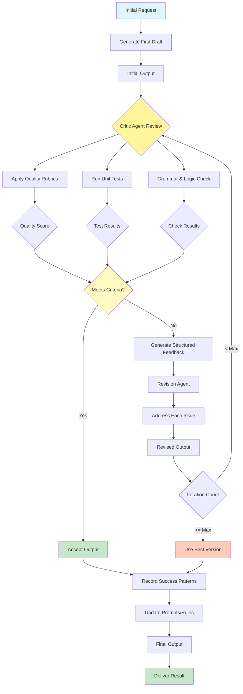

# Reflection Pattern

Visual Diagram

## When to Use

- **Quality-critical outputs**: When high accuracy and quality are non-negotiable
- **Complex reasoning tasks**: When problems require iterative refinement
- **Creative work**: When content needs multiple rounds of improvement
- **Learning systems**: When you want to improve performance over time
- **Error-prone domains**: When initial attempts often have mistakes
- **Compliance requirements**: When outputs must meet specific standards

## Where It Fits

- **Content creation**: Blog posts, reports, and documentation requiring polish
- **Code generation**: Producing bug-free, optimized code
- **Legal document drafting**: Ensuring accuracy and completeness
- **Academic writing**: Research papers needing fact-checking and citations
- **Product descriptions**: E-commerce content requiring SEO and accuracy

## Pros

- **Quality improvement**: Systematic enhancement through multiple iterations
- **Error reduction**: Catches and fixes mistakes before final delivery
- **Objectivity**: Separation of generation and critique roles
- **Learning capability**: System improves over time from patterns
- **Transparency**: Clear feedback trail for improvements
- **Flexibility**: Can adjust critique criteria for different use cases
- **Consistency**: Applies same quality standards uniformly

## Cons

- **Increased latency**: Multiple iterations multiply processing time
- **Higher costs**: Each reflection cycle incurs additional API calls
- **Context window limits**: Long documents may exceed token limits
- **Diminishing returns**: Later iterations may provide minimal improvement
- **Over-optimization**: Risk of making content generic or losing voice
- **Complexity**: Requires careful tuning of critique criteria
- **API throttling**: Multiple rapid calls may hit rate limits

## Real-World Examples

1. **Technical Blog Post Creation**:
   - Initial draft generation
   - Technical accuracy review
   - Code example validation
   - SEO optimization check
   - Readability improvements
   - Final grammar and style polish

2. **Contract Generation System**:
   - Draft initial contract terms
   - Legal compliance review
   - Risk assessment critique
   - Clarity and ambiguity check
   - Client-specific customization
   - Final legal review

3. **Educational Content Development**:
   - Create lesson content
   - Pedagogical effectiveness review
   - Factual accuracy verification
   - Age-appropriateness check
   - Engagement factor assessment
   - Accessibility improvements

4. **Software Documentation**:
   - Generate API documentation
   - Technical accuracy review
   - Code example testing
   - Completeness check
   - Clarity improvements
   - Version consistency validation

5. **Marketing Copy Refinement**:
   - Initial copy generation
   - Brand voice alignment check
   - Persuasiveness assessment
   - Fact and claim verification
   - SEO keyword optimization
   - A/B test variant creation

6. **Research Report Writing**:
   - Draft research findings
   - Methodology critique
   - Statistical validation
   - Citation verification
   - Logical flow improvement
   - Executive summary refinement