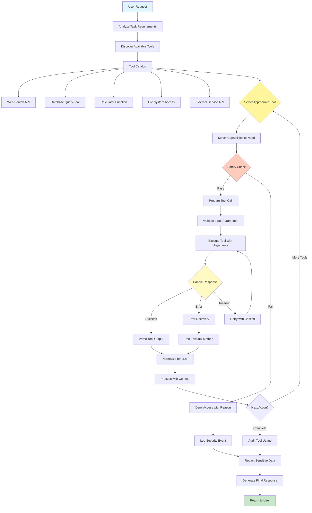

# Tool Use (Function Calling) Pattern

Visual Diagram

## When to Use

- **External data access**: When agents need real-time or dynamic information
- **System integration**: When connecting to databases, APIs, or services
- **Computational tasks**: When precise calculations or data processing is needed
- **File operations**: When reading, writing, or manipulating files
- **Action execution**: When agents need to perform concrete actions
- **Multi-step workflows**: When combining AI reasoning with tool execution

## Where It Fits

- **Research assistants**: Web search, document retrieval, fact-checking
- **Data analysis workflows**: Database queries, calculations, visualizations
- **DevOps automation**: System commands, deployment tools, monitoring
- **Customer service**: CRM access, ticket management, knowledge base queries
- **Content management**: File operations, publishing tools, asset management

## Pros

- **Capability extension**: Agents can perform actions beyond text generation
- **Real-time data**: Access to current information not in training data
- **Precision**: Exact calculations and deterministic operations
- **Integration**: Seamless connection to existing systems and services
- **Automation**: Complete end-to-end workflows without human intervention
- **Flexibility**: Dynamic tool selection based on task requirements
- **Auditability**: Clear log of all tool usage and parameters

## Cons

- **Security risks**: Tool access must be carefully controlled
- **Error propagation**: Tool failures can break entire workflows
- **Latency addition**: Each tool call adds processing time
- **Cost accumulation**: External API calls may incur charges
- **Complexity**: Managing tool schemas and error handling
- **Dependency risks**: Reliance on external services availability
- **Data sensitivity**: Need careful handling of credentials and private data

## Real-World Examples

1. **Financial Analysis Assistant**:
   - Stock price API for real-time quotes
   - Calculator for portfolio calculations
   - Database queries for historical data
   - Chart generation tools for visualizations
   - Email API for report distribution

2. **Code Development Helper**:
   - File system access for reading/writing code
   - Compiler/interpreter for code execution
   - Git commands for version control
   - Testing frameworks for validation
   - Documentation generators

3. **E-commerce Order Management**:
   - Inventory database queries
   - Payment processing APIs
   - Shipping service integrations
   - Email/SMS notification tools
   - CRM system updates

4. **Research Paper Assistant**:
   - Academic database searches (PubMed, arXiv)
   - Citation management tools
   - PDF parsing and extraction
   - Reference formatting tools
   - Plagiarism checking APIs

5. **Smart Home Controller**:
   - IoT device APIs (lights, thermostats)
   - Weather service integration
   - Calendar access for scheduling
   - Energy monitoring tools
   - Security system controls

6. **HR Recruitment System**:
   - Resume parsing tools
   - LinkedIn/job board APIs
   - Calendar scheduling tools
   - Email automation
   - Background check services
   - Video interview platforms